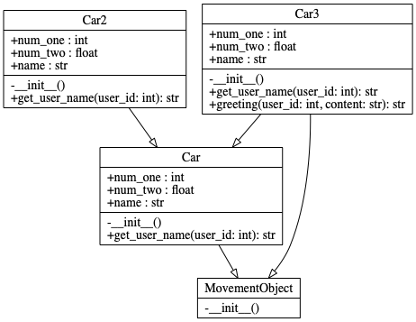

# pyuml
A toy project that generates UML diagrams of Python code by parsing the abstract syntax tree of the target Python code.

## How to use

    ========================================
    2uml  load  config  exit  help  version

    2uml:
    usage: 2uml [-h] input output
    
    Generate UML diagram from Python source code

    positional arguments:
      input       input file/folder
      output      output folder

    optional arguments:
      -h, --help  show this help message and exit
    
    load:
    usage: load [-h] input
    
    Deserialize AST data from serialization data

    positional arguments:
      input       input class name

    optional arguments:
      -h, --help  show this help message and exit
      
    config:
    Print config info
    
    version:
    Print version info
    
    exit:
    Exit the app
      

## A Command Line Interpreter runs on Windows & macOS
You can download it from the [release page](http://github.com/chenjd/pyuml/releases).

## Support [Type Annotation](https://docs.python.org/3/library/typing.html) & [Type Comments](https://www.python.org/dev/peps/pep-0484/#type-comments)

    # Type Annotation
    class Car(MovementObject):
    def __init__(self):
        self.num_one: int = 1
        self.num_two: float = 2.0
        self.name: str = "car"

    def get_user_name(self, user_id: int) -> str:
        return 'car'
https://github.com/chenjd/pyuml/blob/master/test/test_py_code/py_type_annotations.py

    # Type Comments 
    class Car(MovementObject):
    def __init__(self):
        self.num_one = 1  # type: int
        self.num_two = 2.0  # type: float
        self.name = "car"  # type: str

    def get_user_name(self,
                      user_id,  # type: int
                      ):  # type: str
        return 'car'
            
https://github.com/chenjd/pyuml/blob/master/test/test_py_code/py_type_comments.py
      

## Testing

#### Unit Test
You can find unit test in the **test** folder. There are some code resources be used in the tests. There are 23 test cases now.

## Data Persistence
store some information of a class, such as the count of methods in a class etc. in artifact folder.

## Config
  
    [DEFAULT]
    author = jiadong chen
    version = 0.0.1
    url = https://github.com/chenjd/pyuml
userConfig.ini

## Exception Handle
exception information will be written to the error.log file in log folder.

     

