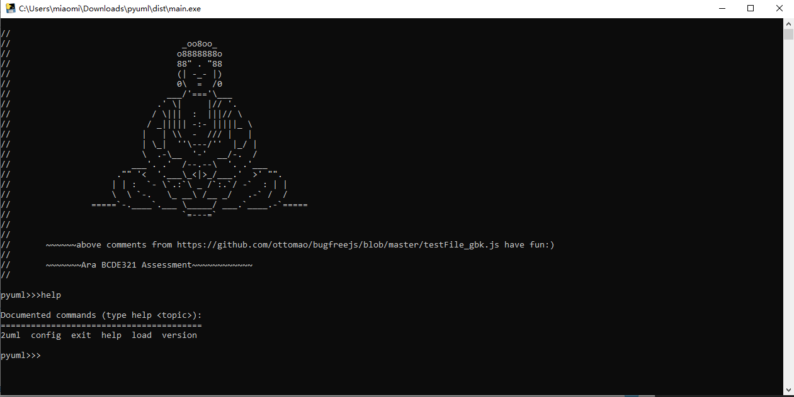
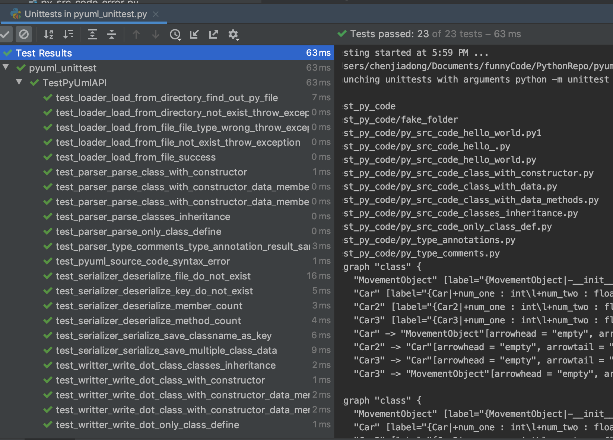
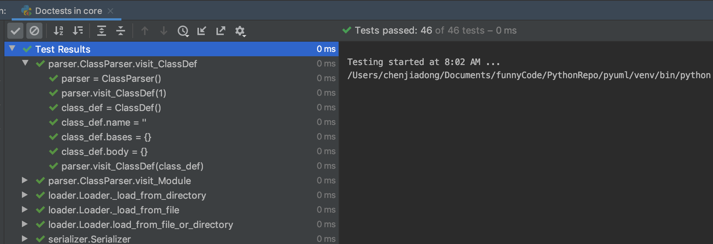

# pyuml

source code -> dot file -> png file

## How to use


    ========================================
    2uml  load  config  exit  help  version

    2uml:
    usage: 2uml [-h] Input Output

    positional arguments:
      Input       input file/folder
      Output      output folder

    optional arguments:
      -h, --help  show this help message and exit
    
    load:
    usage: load [-h] Input

    positional arguments:
      Input       input class name

    optional arguments:
      -h, --help  show this help message and exit
      
## Project Layout
```none
<pyuml>
  ├── main.py
  ├── core
  │   ├── basecmd.py
  │   ├── loader.py
  │   ├── parser.py
  │   ├── serializer.py
  │   └── writer.py
  ├── utilities
  │   └── logger.py
  ├── config
  │   ├── userConfig.ini
  │   └── config.py
  └── test
      ├── test_db
      ├── test_dot_code
      ├── test_py_code
      └── pyuml_unittest.py
```
## A Command Line Interpreter runs on Windows & macOS
You can download it from the [release page](http://github.com/chenjd/pyuml/releases).

## Support [Type Annotation](https://docs.python.org/3/library/typing.html) & [Type Comments](https://www.python.org/dev/peps/pep-0484/#type-comments)

    # Type Annotation
    class Car(MovementObject):
    def __init__(self):
        self.num_one: int = 1
        self.num_two: float = 2.0
        self.name: str = "car"

    def get_user_name(self, user_id: int) -> str:
        return 'car'
https://github.com/chenjd/pyuml/blob/master/test/test_py_code/py_type_annotations.py

    # Type Comments 
    class Car(MovementObject):
    def __init__(self):
        self.num_one = 1  # type: int
        self.num_two = 2.0  # type: float
        self.name = "car"  # type: str

    def get_user_name(self,
                      user_id,  # type: int
                      ):  # type: str
        return 'car'
            
https://github.com/chenjd/pyuml/blob/master/test/test_py_code/py_type_comments.py
      


## Testing

#### Unit Test
You can find unit test in the **test** folder. There are some code resources be used in the tests. There are 23 test cases now.




#### Doc Test
There are many doctest in these .py files in the **core** folder(46 tests) and **utilites** folder(7 tests). such as:

        """ (str, list of ClassRecorder) -> str
        Return dot node string from list of ClassRecorder.

        >>> writer = DotWriter()
        >>> writer.write_node('dot_string', 1)
        Traceback (most recent call last):
        AssertionError
        >>> int_list = (1,2)
        >>> writer.write_node('dot_string', int_list)
        Traceback (most recent call last):
        AssertionError
        >>> class_recorder_list = list((ClassRecorder('test1', list()), ClassRecorder('test2', list())))
        >>> writer.write_node(1, class_recorder_list)
        Traceback (most recent call last):
        AssertionError
        >>> writer.write_node('', class_recorder_list)
        '    "test1" [label="{test1}",shape="record"];\\n    "test2" [label="{test2}",shape="record"];\\n'
        """
        



## Data Persistence
store some information of a class, such as the count of methods in a class etc. in artifact folder.

## Config
  
    [DEFAULT]
    author = jiadong chen & liam
    version = 0.0.1
    url = https://github.com/chenjd/pyuml
userConfig.ini


## Exception Handle
exception information will be written to the error.log file in log folder.

     


